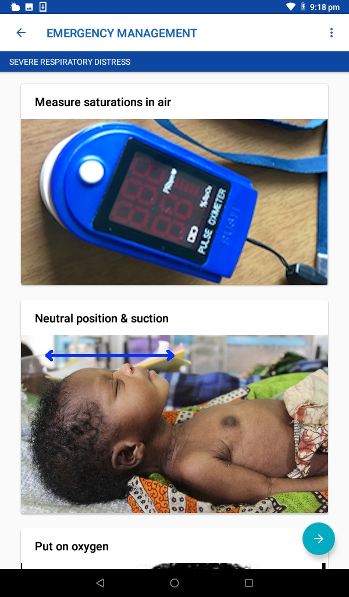
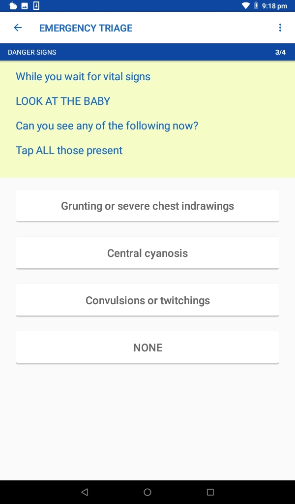
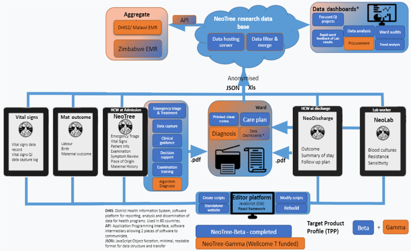

```{r setup1, include=FALSE}
library("knitr")
knitr::opts_chunk$set(echo = FALSE)
# Set root directory from Rmd dir to project dir
opts_knit$set(root.dir = "..")
```

## Example screens from the Neotree app

Below are example screens from the Neotree app showing data capture
and integrated education on neonatal care.

\vspace{12pt}

{width=25%}
{width=25%}
{width=25%}

## Neotree data pipeline at Sally Mugabe Central Hospital

The below flow diagram summarises the current Neotree data pipeline.

\vspace{12pt}

{width=80%}

*Reprinted from Heys et al. 2022 (Learning Health Systems, DOI: 10.1002/lrh2.10310)
in accordance with the CC BY 4.0 license.*
