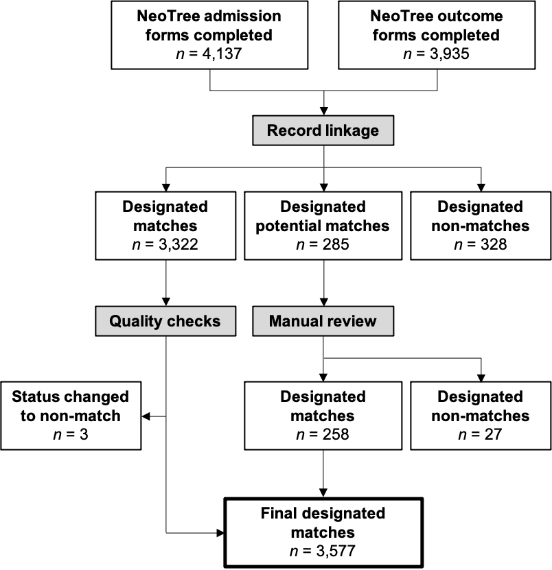

```{r setup4, include=FALSE}
library("knitr")
knitr::opts_chunk$set(echo = FALSE)
# Set root directory from Rmd dir to project dir
opts_knit$set(root.dir = "..")
```

```{r libraries4, include=FALSE}
source("Scripts/0-setup.R")
```

```{r data4, include=FALSE}
# Load data --------------------
adm <- readRDS("Data/prepare1_adm.rds")
dis <- readRDS("Data/prepare1_dis.rds")
```

At the time of our study, the Neotree app required users to manually enter the
automatically generated admission unique identifier (UID) into a free-text field
when completing the outcome form. Therefore, the outcome UID is liable to
typographical errors and is not a 100% reliable key to link admission and outcome
forms. Thus, we linked records using the Fellegi-Sunter framework of probabilistic
record linkage.

## Create data frames for linkage

### Linkage variables

There are 8 variables common to both admission and outcome forms:

1. UID
2. Birth weight
3. Gestation at birth
4. Occipitofrontal circumference at admission
5. Length at admission
6. Mode of delivery
7. Sex
8. Place of birth

These have the following levels of missingness in the admission
forms:

```{r variables}
common_variables <- vector("list")
common_variables$adm <- c("Admission.UID_alphanum", "Admission.BW", "Admission.Gestation",
                          "Admission.OFC", "Admission.Length", "Admission.ModeDelivery",
                          "Admission.Gender", "Admission.PlaceBirth")
common_variables$dis <- c("Discharge.NeoTreeID_alphanum", "Discharge.BWTDis",
                          "Discharge.GestBirth", "Discharge.OFCDis", "Discharge.LengthDis",
                          "Discharge.Delivery", "Discharge.SexDis", "Discharge.BirthPlace")

adm %>% select(common_variables$adm) %>% miss_var_summary
```

And in the outcome forms:

```{r variables2}
dis %>% select(common_variables$dis) %>% miss_var_summary
```

Note `Place of birth` has `r round(pct_miss(adm$Admission.PlaceBirth), 1)`%
missing values in the admission forms. It is also coded differently between
admission and outcome forms:

```{r variables3}
list(
  admission = tibble(
    levels = levels(as.factor(adm$Admission.PlaceBirth)),
    definition = c("born before arrival",
                   "health centre",
                   "home",
                   "hospital",
                   "traditional birth attendant")
    ),
  outcome = tibble(
    levels = levels(as.factor(dis$Discharge.BirthPlace)),
    definition = c("home",
                   "Harare Central Hospital",
                   "other clinic in Harare",
                   "other clinic outside Harare")
    )
  )
```

Although `Gestation at birth` has `r round(pct_miss(dis$Discharge.GestBirth), 1)`%
missing values in the outcome forms, it is a numeric variable and, therefore,
coded the same between admission and outcome forms:

```{r variables4}
list(
  admission = adm %>%
    filter(!is.na(Admission.Gestation)) %>%
    pull(Admission.Gestation) %>%
    head(),
  discharge = dis %>%
    filter(!is.na(Discharge.GestBirth)) %>%
    pull(Discharge.GestBirth) %>%
    head()
)
```

Thus, we used 7 variables for record linkage (excluding `Place of birth`):

1. Unique ID\text{*}
2. Birth weight
3. Gestation at birth
4. Occipitofrontal circumference at admission
5. Length at admission
6. Mode of delivery
7. Sex
8. ~~Place of birth~~

\text{*} **Special note on UID:** After the first month of the project,
healthcare workers were told to only enter the first 3 and last 3 characters of
the UID in the outcome form. This is because the UID was initially
long and laborious to type and, hence, prone to error. Therefore, most outcome
form UIDs are 6 characters long, except those from the first month of the project.
To avoid confusion, we used a substring of the full UIDs (called `uidsub`) for
linkage. This substring consists of the first 3 and last 3 characters of the UID,
converted to lowercase. E.g. (fictitious example),

```{r uid_example}
# Fictitious example
cbind(
  full = c("AB123456", "AB789012"),
  uidsub = c("ab1456", "ab7012")
)
```

### Linkage data frames

```{r link_dfs}
# Create the admission form linkage data frame
adm_link <- adm %>%
  select(
    uid = Admission.UID_alphanum,
    bw = Admission.BW,
        gest = Admission.Gestation,
         ofc = Admission.OFC,
         length = Admission.Length,
         mode = Admission.ModeDelivery,
         sex = Admission.Gender,
         session = Admission.session
         # keep session to uniquely identify each entry
    ) %>%
  mutate(
    first = substr(.$uid, 1, 3),
    last = substr(.$uid, nchar(.$uid)-2, nchar(.$uid)),
      uidsub = tolower(paste0(first, last))
    ) %>%
  select(-c(uid, first, last))

# Create the discharge form linkage data frame
dis_link <- dis %>%
  select(
    uid = Discharge.NeoTreeID_alphanum,
         bw = Discharge.BWTDis,
         gest = Discharge.GestBirth,
         ofc = Discharge.OFCDis,
         length = Discharge.LengthDis,
         mode = Discharge.Delivery,
         sex = Discharge.SexDis,
         session = Discharge.session
    ) %>%
  mutate(
    first = substr(.$uid, 1, 3),
    last = if_else(nchar(.$uid) < 6,
         substr(.$uid, 4, nchar(.$uid)),
          substr(.$uid, nchar(.$uid)-2, nchar(.$uid))),
         uidsub = tolower(paste0(first, last))
    ) %>%
  select(-c(uid, first, last))

# list(
#   admission = head(adm_link),
#   outcome = head(dis_link)
# )
```

Below is a fictitious example of the data frame structure for record linkage:

```{r link_dfs_example}
adm_link_eg <- tibble(
  bw = c("3000", "4000", "1800", "3500"),
  gest = c("41", "40", "35", "40"),
  ofc = c("32", "37", "31", "33"),
  length = c("46", "46", "44", "48"),
  mode = c("SVD", "ECS", "SVD", "SVD"),
  sex = c("M", "F", "F", "M"),
  session = c("session 10000", "session 10001", "session 10002", "session 10003"),
  uidsub = c("ab1789", "ab2567", "ab3689", "ab1478")
)

dis_link_eg <- tibble(
  bw = c("3320", "1900", "1900", "1300"),
  gest = c(NA, '32', "34", "32"),
  ofc = c("32", "32", "30", "29"),
  length = c("48", "47", "45", "39"),
  mode = c("SVD", "ECS", "SVD", "ECS"),
  sex = c("F", "F", "M", "M"),
  session = c("session 100000", "session 100001", "session 100002", "session 100003"),
  uidsub = c("cd3567", "cd1378", "cd8364", "cd9246")
)

list(
  admission = head(adm_link_eg),
  outcome = head(dis_link_eg)
)
```


## Perform record linkage

### Run linkage algorithm

We performed record linkage using the `fastLink` package by Enamorado, Fifield
and Imai (<https://github.com/kosukeimai/fastLink>). Linkage is performed using
the `fastLink::fastLink()` wrapper.

```{r link, echo=TRUE, message=FALSE, results='hide', cache=TRUE}
set.seed(123)

matches_out <- fastLink(
  dfA = adm_link,
  dfB = dis_link,
  varnames = c("uidsub", "bw", "gest", "ofc", "length", "mode", "sex"),
  stringdist.match = c("uidsub"), # use string dist matching on uidsub
  stringdist.method = "jw", # Jaro-Winkler
  jw.weight = .10, # Jaro-Winkler weight for prefix
  partial.match = c("uidsub"), # allow partial matching for uidsub
  cut.a = 0.96, # full string-distance match cut point (Winkler, 1990)
  cut.p = 0.88, # partial string-distance match cut point (Winkler, 1990)
  dedupe.matches = TRUE, # enforces one-to-one matching
  cond.indep = TRUE, # assuming conditional independence for Fellegi-Sunter model
  return.all = TRUE # sets threshold.match to 0.0001
)
```

All other parameters were left as the default (see
[fastLink documentation](https://github.com/kosukeimai/fastLink)).

### Determine thresholds

We plot the posterior probabilities (zeta) and their corresponding
Fellegi-Sunter weights, as demonstrated by Weber. _Note that the y-axes values
are displayed as the natural logarithm of 1 plus the number of records at each
zeta or weight._

```{r plot_weights_zetas, fig.show='hold', out.width='50%'}
# Combine important linkage output to a sigle data frame
zetas <- tibble(zeta.j = matches_out$EM$zeta.j)
weights <- as_tibble(matches_out$EM$patterns.w)
link_output <- cbind(weights, zetas)

# Plot Fellegi-Sunter weights
# Note the "log(1 + counts)" y-axis scale
plot_weights <- link_output %>%
  ggplot(aes(x = weights, y = log(1 + counts), group = 1)) +
  geom_point() +
  geom_line(linetype = "dotted") +
  scale_x_continuous() + 
  labs(
    x = "Weight",
    y = expression("Log"[2]*"(Frequency)")
  ) +
  NULL

# Plot zetas
# Note the "log(1 + counts)" y-axis scale
plot_zetas <- link_output %>%
  ggplot(aes(x = zeta.j, y = log(1 + counts), group = 1)) +
  geom_point() +
  geom_line(linetype = "dotted") +
  scale_x_continuous() +
  labs(
    x = "Posterior probability (threshold)",
    y = expression("Log"[2]*"(Frequency)")
  ) +
  NULL

plot_weights
plot_zetas
```

We then plot the frequencies of matches and non-matches, and the false positive
rate (aka false detection rate [FDR]) and false negative rate (FNR) across the
range of probability thresholds.

```{r plot_frequencies, fig.show='hold', out.width='50%'}
# Create a data frame of matches, non-matches, FDR and FNR across thresholds
confusion_df <- data.frame(
  threshold = seq(0, 0.98, 0.02),
  match = NA, non_match = NA,
  FDR = NA, FNR = NA)
for (i in 1:nrow(confusion_df)){
  x <- fastLink::confusion(matches_out, threshold = confusion_df[i,1])
  confusion_df[i,2] <- x$confusion.table[1,1] + x$confusion.table[1,2]
  confusion_df[i,3] <- x$confusion.table[2,1] + x$confusion.table[2,2]
  confusion_df[i,4] <- x$addition.info[6]
  confusion_df[i,5] <- x$addition.info[7]
}
confusion_df <- confusion_df %>%
  pivot_longer(c("match", "non_match", "FDR", "FNR"))

# Plot number of matches and non-matches
plot_matches <- confusion_df %>%
  filter(name == "match" | name == "non_match") %>%
  ggplot(aes(x = threshold, y = value, colour = name)) +
  geom_line() +
  scale_y_log10() +
  scale_x_continuous(
    breaks = seq(0, 1, .1),
    labels = scales::number_format(accuracy = 0.01),
    limits = c(0,1)
  ) +
  scale_color_manual(
    name = NULL,
    labels = c("Declared match", "Declared non-match"), 
    values = c("blue", "red")
  ) + 
  #add lines to indicate sudden changes
  geom_vline(xintercept = c(.1, .45, .9), linetype = 2, colour = "grey70") +
  labs(
    x = "Posterior match probability",
    y = "Number of records"
  ) +
  theme_classic2(base_size = 13) +
  theme(legend.position = "top") +
  NULL

# Plot FDR and FNR
plot_rates <- confusion_df %>%
  filter(name == "FDR" | name == "FNR") %>%
  ggplot(aes(x = threshold, y = value, colour = name)) +
  geom_line() +
  scale_y_log10(labels = function(x) paste0(x, "%")) +
  scale_x_continuous(
    breaks = seq(0, 1, .1),
    labels = scales::number_format(accuracy = 0.01),
    limits = c(0,1)
  ) +
  scale_color_manual(
    name = NULL,
    labels = c("False positive rate", "False negative rate"), 
    values = c("magenta", "green3")
  ) + 
  #add lines to indicate sudden changes
  geom_vline(xintercept = c(.1, .45, .9), linetype = 2, colour = "grey70") +
  labs(
    x = "Posterior match probability",
    y = expression("Rate")
  ) +
  theme_classic2(base_size = 13) +
  theme(legend.position = "top") +
  NULL

plot_matches
plot_rates

# Combine into one figure and save
link_fig1 <- plot_grid(plot_matches, plot_rates, nrow = 1, labels = "AUTO")
ggsave("Figures/link_fig1.png", link_fig1, width = 10, height = 4, dpi = 300)
```

Considering the graphs, there appears to be an abrupt change in the number of
matches vs. non-matches, and the FDR at zetas of ~0.10, ~0.45 and ~0.90
(_dotted lines_). The FNR appears essentially constant at 0.01% across all
values of zeta.

It is most important to minimise the FDR (i.e. minimise the likelihood of
declaring records a match when they are not a true match). Therefore, we set the
threshold for declared matches very high (__zeta = 0.98__), which yielded an FDR
<0.5%. We set the lower threshold (for declaring potential matches requiring
manual review) at __zeta = 0.10__, based on the abrupt changes in the above
graphs at this point.

* Zeta = 0.10 corresponds to Fellegi-Sunter weight = ~6.2.
* Zeta = 0.98 corresponds to Fellegi-Sunter weight = ~12.2.

Below are the zeta and Fellegi-Sunter weight plots with thresholds superimposed:

```{r plot_weights_zetas2, fig.show='hold', out.width='50%'}
# Plot Fellegi-Sunter weights with chosen thresholds
# Note the "log(1 + counts)" y-axis scale
plot_weights2 <- link_output %>%
  ggplot(aes(x = weights, y = log(1 + counts), group = 1)) +
  geom_point() +
  geom_line(linetype = "dotted") +
  geom_vline(xintercept = 6.2, linetype = "dashed", colour = "blue") +
  annotate("label", x = 6.2, y = 15, label = "L = 6.2",
           colour = "blue", size = 3) +
  geom_vline(xintercept = 12.2, linetype = "dashed", colour = "red") +
  annotate("label", x = 12.2, y = 15, label = "U = 12.2",
           colour = "red", size = 3) +
  scale_x_continuous() + 
  scale_y_continuous(limits = c(0,16), breaks = seq(0,16,4)) +
  labs(
    x = "Fellegi-Sunter weight",
    y = "log(1 + frequency)"
  ) +
  theme_classic2(base_size = 13) +
  NULL

# Plot zetas with chosen thresholds
# Note the "log(1 + counts)" y-axis scale
plot_zetas2 <- link_output %>%
  ggplot(aes(x = zeta.j, y = log(1 + counts), group = 1)) +
  geom_point() +
  geom_line(linetype = "dotted") +
  geom_vline(xintercept = 0.10, linetype = "dashed", colour = "blue") +
  annotate("label", x = 0.10, y = 15, label = "L = 0.10",
           colour = "blue", size = 3) +
  geom_vline(xintercept = 0.98, linetype = "dashed", colour = "red") +
  annotate("label", x = 0.98, y = 15, label = "U = 0.98",
           colour = "red",size = 3) +
  scale_x_continuous() +
  scale_y_continuous(limits = c(0,16), breaks = seq(0,16,4)) +
  labs(
    x = "Posterior match probability",
    y = "log(1 + frequency)"
  ) +
  theme_classic2(base_size = 13) +
  NULL

plot_zetas2
plot_weights2

# Combine into one figure
link_fig2 <- plot_grid(plot_zetas2, plot_weights2, nrow = 1, labels = "AUTO")
ggsave("Figures/link_fig2.png", link_fig2, width = 10, height = 4, dpi = 300)
```

The chosen thresholds result in the following confusion tables:

```{r confusion_matrix}
confmat <- list(
  lower_thres = confusion(matches_out, threshold = 0.1),
  upper_thres = confusion(matches_out, threshold = 0.98)
)
confmat

# Get number of non-matches at each threshold
non_match_lower <- confmat$lower_thres$confusion.table[2,1] +
  confmat$lower_thres$confusion.table[2,2]
non_match_upper <- confmat$upper_thres$confusion.table[2,1] +
  confmat$upper_thres$confusion.table[2,2]
```

This results in __`r non_match_upper - non_match_lower` records for manual
review.__ We deemed this to be an acceptable and pragmatic number of records
to review manually.

### Get matches and potential matches at chosen thresholds

We subset the linkage data frames to return a data frame of matches and a data
frame of potential matches using the `fastLink::getMatches()` function.

```{r get_matches, echo=TRUE}
matches_list <- vector("list")

# With zeta >0.98 (matches)
matches_list$low <- getMatches(
  dfA = adm_link,
  dfB = dis_link,
  fl.out = matches_out,
  threshold.match = 0.98,
  combine.dfs = FALSE
)

# With zeta >0.10 (matches + potential matches)
matches_list$high <- getMatches(
  dfA = adm_link,
  dfB = dis_link,
  fl.out = matches_out,
  threshold.match = 0.10,
  combine.dfs = FALSE
)

# Session IDs for potential matches
matches_list$potential_adm <-
  matches_list$high$dfA.match$session[!matches_list$high$dfA.match$session
    %in% matches_list$low$dfA.match$session]

matches_list$potential_dis <-
  matches_list$high$dfB.match$session[!matches_list$high$dfB.match$session
                                      %in% matches_list$low$dfB.match$session]
```

We build this into a full data frame with all Neotree variables for
matches and potential matches by merging on session ID (which uniquely identifies
each completed admission or outcome form). N.B. `adm` and `dis` are the complete
data frames of Neotree admission forms and outcome forms, respectively.

```{r get_matches2, echo=TRUE}
# Build into data frames
# Designated matches from fastLink
matches_list$matches <- tibble(
  Admission.session = matches_list$low$dfA.match$session,
  Discharge.session = matches_list$low$dfB.match$session
) %>%
  merge(adm, by = "Admission.session") %>%
  merge(dis, by = "Discharge.session")

# Potential matches from fastLink
matches_list$potentials <- tibble(
  Admission.session = matches_list$potential_adm,
  Discharge.session = matches_list$potential_dis
) %>%
  merge(adm, by = "Admission.session") %>%
  merge(dis, by = "Discharge.session")
```

There are __`r nrow(matches_list$matches)` declared matches,
`r nrow(matches_list$potentials)` declared potential matches, and
`r min(nrow(adm), nrow(dis)) - nrow(matches_list$matches) - nrow(matches_list$potentials)`
non-matches__ from the Fellegi-Sunter linkage algorithm.

## Manual review of potential matches

Potential matches are manually reviewed to determine their true match status. We
used several factors to make a clinical judgement, including:

* Admission and outcome UIDs - any discrepancies are plausible (e.g. likely to
represent a typographical error).
* Admission date and outcome (discharge or death) date - congruent and plausible.
* Admission reason/diagnosis and discharge diagnosis or cause of death - congruent.
* A review of all other variables looking for any unique features on the admission
and outcome form that might indicate a true match.

```{r review_potentials}
# Save potential matches to a .csv file
# Reorder some columns first
matches_list$potentials %>%
  select(
    Admission.UID_alphanum,
    Discharge.NeoTreeID_alphanum,
    Admission.session,
    Discharge.session,
    all_of(c(common_variables$adm, common_variables$dis)),
    Admission.DateTimeAdmission,
    Discharge.DateTimeDischarge,
    Discharge.DateTimeDeath,
    Admission.AdmReason,
    Admission.Diagnoses,
    Discharge.PresCom,
    Discharge.DIAGDIS1,
    Discharge.OthProbs,
    Discharge.CauseDeath,
    Discharge.ContCauseDeath,
    everything()
    ) %>%
  write.csv("Reports/potential_matches.csv")

## MANUALLY REVIEW RECORDS HERE

# Exclude non-matches from potentials (based on manual review)
matches_list$potentials <- matches_list$potentials %>%
  filter(!Admission.session %in% readLines("Scripts/not_potentials.txt"))

# Final set of matches
dat <- rbind(matches_list$matches, matches_list$potentials)
```

From manual review of the potential matches, we decided that
__`r nrow(matches_list$potentials)`__ were true matches. Thus, there were
__`r nrow(dat)`__ declared matches at this stage.

### Quality checks

Finally, we performed several additional 'quality checks' to identify
false-positive matches or other irregularities.

First, we checked for duplicate admission or outcome session IDs (i.e. duplicate
completed admission or outcome forms) in the final linked dataset.

* Duplicated admission forms: _n_ = `r sum(duplicated(dat$Admission.session))`
* Duplicated outcome forms: _n_ = `r sum(duplicated(dat$Discharge.session))`

Therefore, the one-to-one matching constraint was successful.

Next, we checked for duplicate admission or outcome UIDs in the final linked
dataset.

* Duplicated admission UIDs: _n_ = `r sum(duplicated(dat$Admission.UID_alphanum))`
* Duplicated outcome UIDs: _n_ = `r sum(duplicated(dat$Discharge.NeoTreeID_alphanum))`

Looking at an extract from these duplicates, it was clear that they are unique
babies with, for example, different birth weights, gestational ages, admission
reasons, discharge diagnosis or outcome despite the same UID.

```{r quality, include=FALSE}
# View the head of these duplicates
dat %>%
  filter(
    (duplicated(Admission.UID_alphanum) |
       duplicated(Admission.UID_alphanum, fromLast = T)) &
      (duplicated(Discharge.NeoTreeID_alphanum) |
         duplicated(Discharge.NeoTreeID_alphanum, fromLast = T))
    ) %>%
  arrange(
    Admission.UID_alphanum,
    Discharge.NeoTreeID_alphanum
    ) %>%
  select(
    Admission.UID_alphanum,
    Discharge.NeoTreeID_alphanum,
    Admission.session,
    Discharge.session,
    Admission.BW,
    Admission.Gestation,
    Admission.AdmReason,
    Discharge.NeoTreeOutcome,
    Discharge.DIAGDIS1) %>%
  head(4)
```

Finally, we checked for invalid admission durations (i.e. cases where the outcome
date came before the admission date, or where the interval was unusually long).

Acceptable discrepancies:

* Outcome date $\leq$ 1 day prior to admission date - this could occur if the admission
form was completed retrospectively shortly after the outcome form (e.g. if a baby
was deceased on or soon after arrival to the neonatal unit).

Unacceptable discrepancies:

* Outcome date > 1 day prior to admission date
* Admission duration shown to be > 4 months - this is not a plausible admission
duration for the neonatal unit at Sally Mugabe Central Hospital.

```{r quality2, include=FALSE}
# Check for admission duration discrepancies
# Create outcome date and convert dates to POSIXct
dat <- dat %>%
  mutate(
    outcome_datetime = case_when(
      Discharge.NeoTreeOutcome == "NND" ~ ymd_hms(
        Discharge.DateTimeDeath,
        tz = "Africa/Harare"
        ),
      Discharge.NeoTreeOutcome != "NND" ~ ymd_hms(
        Discharge.DateTimeDischarge,
        tz = "Africa/Harare")
      ),
    adm_datetime = ymd_hms(Admission.DateTimeAdmission, tz = "Africa/Harare")
)

# Determine admission duration
dat <- dat %>%
  mutate(adm_dur = as.period(
    interval(
      dat$adm_datetime,
      dat$outcome_datetime)
    )
  )

# Filter data based on admission duration
# Outcome date >1 day prior to admission date
neg_dur <- dat %>%
  filter(adm_dur < days(-1)) %>%
  select(
    Admission.DateTimeAdmission,
    Discharge.DateTimeDischarge,
    Discharge.DateTimeDeath,
    Admission.UID_alphanum,
    Discharge.NeoTreeID_alphanum,
    Admission.session,
    Discharge.session
  )

# Admission duration shown to be >4 months
long_dur <- dat %>%
  filter(adm_dur > months(4)) %>%
  select(
    Admission.DateTimeAdmission,
    Discharge.DateTimeDischarge,
    Discharge.DateTimeDeath,
    Admission.UID_alphanum,
    Discharge.NeoTreeID_alphanum,
    Admission.session,
    Discharge.session
  )

```

Distribution of admission durations:

```{r quality3}
summary(dat$adm_dur)
```


* Outcome date prior to admission date: _n_ = `r sum(dat$adm_dur < 0)`
  + $\leq$ 1 day prior: _n_ = `r sum(dat$adm_dur < days(0) & dat$adm_dur >= days(-1))`
  + \> 1 day prior: _n_ = `r sum(dat$adm_dur < days(-1))`
* Admission duration shown to be >4 months: _n_ = `r sum(dat$adm_dur > months(4))`

We changed the status of these `r sum(nrow(neg_dur) + nrow(long_dur))`
cases to "non-match", to err on the side of caution. We felt these most likely
represented false-positive matches.

```{r quality4}
# Get admission session IDs for these cases
neg_session <- neg_dur %>% pull(Admission.session)
long_session <- long_dur %>% pull(Admission.session)
neg_session
long_session

# Exclude from final linked dataset
dat <- dat %>%
  filter(!Admission.session %in% c(neg_session, long_session))
```

New distribution of admission durations:

```{r quality5}
summary(dat$adm_dur)
```

__A total of `r nrow(dat)` record pairs were thus included in the final linked
dataset.__

\clearpage

### Flow diagram

{width=50%}
